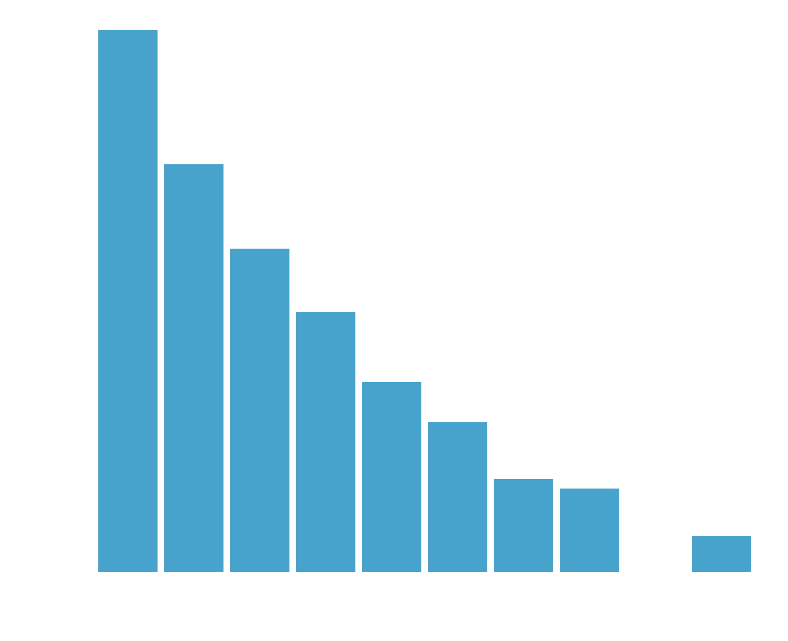
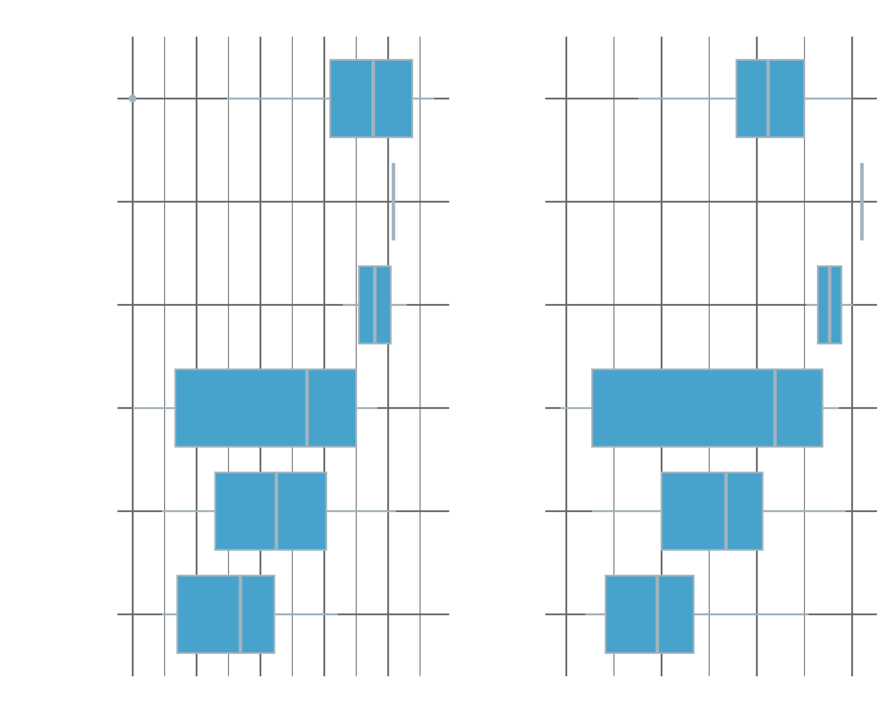

I am currenlty a PhD student at the [Institute of Genetics and Cancer](https://www.ed.ac.uk/institute-genetics-cancer) in Edinburgh, which is never where I thought I would end up given that when I was 15 I was literally counting down the days until I never had to study biology again. Since then I went to college and university and I studied maths and when it came to choosing what  wanted to write my dissertation on  decided I wanted to do some machine learning and the supervisor I chose was a mathematical biologist. I wrote my dissertation on machine learning, applying it to a scRNA-seq data set and it opened my eyes to the world of genetics and all the cool maths they are using. 

I've now been working in genetics for about two years and I really enjoy it, but when I first started it was very overwhelming to be contantly bombarded with words that I did not know. I've got a lot better but it's still hard sometimes to keep up with presentations. Recently, I was reading a paper and I was finding it hard to keep up with all the biological terms and I wondered "would I be able to train a machine learning algorithm to read biology papers?". This idea stuck with me and I thought it might be a fun idea to try.

If you would like to see the code for this project you can find it here:



## The Problem

From the outset I would like to make it clear that as well as only recently learning about biology I know next to nothing about machine learning on text, so please don't use this as a guide to learn from! The first thing I had to do was to find a problem to work on. Given my inexperience I thought I'd try and start with something (I thought would be) fairly simple. 

Cancer is very very complex indeed so I have decided to drastically oversimply it for this project. You can essentially think of cancer as when cells start to grow out of control. There are many causes of cancer but a major cause is when the DNA in a particular cell gets mutated in a certain way. DNA in your cells get mutated all the time, but if a certain part of your DNA (which we call a gene) gets mutated in a particular way then this can cause that cells to grow and divide uncontrollably. The beginning of this process is called oncogenesis and the mutations that cause this are called oncogenic mutations, specifically these mutations that cause the cell to grow and divide uncontrollably are called gain of function mutations.

However, your cells are clever and have lots of self regulatory mechanisms that are able to recognise that something is going wrong and cause the cell to essentially self destruct (this is called apoptosis). So a gain of function mutation on its own is not usually enough to cause cancer as your body will recognise this and stop it. Therefore, you need another (oncogenic) mutation to stop the cell from self destructing. These mutations are called loss of function mutations. You can then think of cancer as a cell having both a gain of function mutation and a loss of function mutation. There are many different genes that are gain of function and many that are loss of function and I thought for this project it might be cool to see if we could identify whether a gene is related with gain of function or loss of function mutations from the abstract of a paper.

## Data Collection

The first step of any machine learning project is collecting data. I was originally planning on trying to write my own web scraper to collect the information I wanted, when I started looking into it I found that PubMED has its own API that allows you to search for papers and download the abstracts. This was great as it meant I didn't have to write my own web scraper and I could just use the API. What was even better was that there is a python package called [PyMed](https://package.wiki/pymed) that allows you to easily interact with the PubMED API and is basically the only reason why I was able to do this project.

Having figured out how I would be able to access abstracts I now needed a list of gain of function (GOF) and loss of function (LOF) genes. This, again, was much much more difficult than I had assumed it would be (as is always the way) but I did manage to find such information on [CancerQuest](https://www.cancerquest.org/cancer-biology/cancer-genes) which I used to create lists of GOF and LOF genes that I put into a Python dictionary

``` python
search_genes = {
    "GOF": [
        'ABL1', 'AFF4', 'AKAP13', 'AKT2', 'ALK', 'AML1',
        'AXL', 'BCL-2', 'BCL-3', 'BCL-6', 'BCR', 'CAN',
        'CBFB', 'CCND1', 'CSF1R', 'DEK', 'E2A', 'EGFR', 
        'ERBB2', 'ERG', 'ETS1', 'EWSR1', 'FES', 'FGF3',
        'FGF4', 'FLI1', 'FOS', 'FUS', 'GLI1', 'GNAS', 
        'HER2', 'HRAS', 'IL3', 'JUN', 'K-SAM', 'KIT', 
        'KRAS', 'LCK', 'LMO1', 'LMO2', 'LYL1','MAS1', 
        'MCF2', 'MDM2', 'MLLT11', 'MOS', 'MTG8', 'MYB', 
        'MYC', 'MYCN', 'MYH11', 'NEU', 'NFKB2', 'NOTCH1', 
        'NPM', 'NRAS', 'NRG', 'NTRK1', 'NUP214', 'PAX-5', 
        'PBX1', 'PIM1', 'PML', 'RAF1', 'RARA', 'REL', 
        'RET', 'RHOM1', 'RHOM2', 'ROS1', 'RUNX1', 'SET', 
        'SIS', 'SKI', 'SRC', 'TAL1', 'TAL2', 'TCF3', 
        'TIAM1', 'TLX1', 'TSC2'
    ],
    "LOF": [
        'APC', 'BRCA1', 'BRCA2', 'CDKN2A', 'DCC', 
        'DPC4', 'MADR2', 'MEN1', 'NF1', 'NF2', 'PTEN', 
        'RB1', 'TP53', 'VHL', 'WRN', 'WT1'
    ]
}
```

Now we have to iterate over these lists to generate a list of abstracts for each gene. I found a great [StackOverflow article](https://stackoverflow.com/questions/57053378/query-pubmed-with-python-how-to-get-all-article-details-from-query-to-pandas-d) on how to do this and output the results as a pandas data frame. I then saved this data frame as a tsv file to be processed later.

``` python
from pymed import PubMed
import pandas as pd

pubmed = PubMed(tool="GeneSearcher", email="<YOUR_EMAIL>")

data = pd.DataFrame(columns=['pubmed_id','title','abstract','gene','gene_type','keywords','journal','conclusions','methods','results','copyrights','doi','publication_date','authors'])

for gene_type in search_genes.keys():
    for gene in search_genes[gene_type]:
        results = pubmed.query(gene, max_results=500)
        articleList = []
        articleInfo = []
        for article in results:
            articleDict = article.toDict()
            articleList.append(articleDict)
        for article in articleList:
            pubmedId = article['pubmed_id'].partition('\n')[0]
            articleInfo.append({u'pubmed_id':pubmedId,
                            u'title':article['title'],
                            u'abstract':article['abstract'],
                            u'gene':gene,
                            u'gene_type':gene_type,
                            #u'keywords':article['keywords'],
                            #u'journal':article['journal'],
                            #u'conclusions':article['conclusions'],
                            #u'methods':article['methods'],
                            #u'results': article['results'],
                            #u'copyrights':article['copyrights'],
                            #u'doi':article['doi'],
                            #u'publication_date':article['publication_date'], 
                            #'authors':article['authors']
                        })
        appendPD = pd.DataFrame.from_dict(articleInfo)
        data = data.append(appendPD)
        
data.to_csv(
    "data/mutation-abstracts.csv", 
    sep="\t",
    index=False
)
```

You can see here that there are many other bits of information I could have collected from the API, but I decided to just collect the abstracts as I thought this would be enough to train a model, it also would require some more careful handling of the request in the cases of missing data. I also limited the number of results to 500 as I didn't want to be collecting data for too long. In an ideal world I would have collected all of the data and used it to perform meta-analysis of my work, investigating whether there are other factors affecting the model. For example, if a particular author writes about one gene and has a particular writing style then the model will associate that author's writing style with the gene and not the content of the article. I didn't have time to do this but it would have been interesting to see.

If you would like to follow along with the rest of this project without performing this step yourself, you can download the data set that I created here.


Download Abstracts Data



## Data Pre-Processing

Although we have collected our data, we still need to do some pre-processing before we can start training our model. To do this we can load our data into R and take a look at it.

``` r
library(tidyverse)

raw_data <- read_delim("./data/mutation-abstracts.csv", delim = "\t") %>%
  select(pubmed_id, title, abstract, gene, gene_type)

head(raw_data)
```

    ## # A tibble: 6 × 5
    ##   pubmed_id title                                       abstract gene  gene_type
    ##       <dbl> <chr>                                       <chr>    <chr> <chr>    
    ## 1  35650277 Measurable residual disease analysis in pa… "ABL-cl… ABL1  GOF      
    ## 2  35647282 Development of a First-in-Class Small-Mole… "Heat s… ABL1  GOF      
    ## 3  35644022 Prognostic utility of key copy number alte… "T-cell… ABL1  GOF      
    ## 4  35641210 Chemotherapy Resistance in B-ALL with Cryp… "BCR-AB… ABL1  GOF      
    ## 5  35641028 Dasatinib suppresses atherosclerotic lesio… "Althou… ABL1  GOF      
    ## 6  35634195 A rare case of B-lymphoid blast phase of c… "Chroni… ABL1  GOF

We have 5 different variables in the data set

<!-- prettier-ignore-start -->
| Variable      | Description                                                                    |
| ------------- | ------------------------------------------------------------------------------ |
| `pubmed_id`   | A unique number that identifies each article                                   |
| `title`       | The title of the article                                                       |
| `abstract`    | The abstract of the article                                                    |
| `gene`        | The name of the gene that was searched for and returned this article           |
| `gene_type`   | Whether the gene that was searched for is associated with GOF or LOF mutations |
<!-- prettier-ignore-end -->

Each row here represents a pubmed article and records the gene that was searched for that returned it. Therefore, there are multiple rows relating to the same article that will have been returned in multiple searches, we can see that in this graph.



We need to make a new table that only has each abstract in it once with a label indicating whether it is a GOF or LOF mutation. We can do this by grouping the data by `pubmed_id` and counting the number of times each article is linked with a GOF related gene and an LOF related gene. We can then convert these two numbers into a `log_score` using the formula


\\(\log_2[\frac{GOF}{LOF}]\\)

This will return a positive number if the article is more likely to be related to GOF mutations and a negative number if it is more likely to be related to LOF mutations. We can then use this `log_score` to label each article as either GOF or LOF. As a side note, if an article is only returned with respect to GOF genes then the `log_score` will be infinity and negative infinity for LOF. To be on the safe side, if we take our logs to base 2 then we can filter `log_score` to have an absolute value of at least 2. This means that only articles that are only associated with GOF and LOF genes or which are 4 times more associeted with one type are kept. We can then save out this data set to be loaded into whatever language we like for training a model.

``` r
data <- raw_data %>%
  group_by(pubmed_id, abstract) %>%
  summarise(
    GOF = sum(gene_type == "GOF"),
    LOF = sum(gene_type == "LOF"),
    log_score = log2(GOF/LOF)
  ) %>%
  filter(
    abs(log_score) >= 2
  ) %>%
  mutate(
    gene_type = ifelse(log_score > 0, "GOF", "LOF")
  ) %>%
  select(pubmed_id, abstract, gene_type)

  write_delim(data, "./data/processed_abstracts.csv", delim = "\t")
```

## Data Processing

Now here I have to express again, I am not an expert in text based analysis. However, it starts off pretty similar to what I am used to, I need to make a test/train split of my data. Generally for machine learning I use the `tidymodels` framework in R and so I make the split through the `rsample` package.

``` r
library(tidymodels)

data_splits <- initial_split(data, prop = 0.8, strata = gene_type)
data_train <- training(data_splits)
data_test <- testing(data_splits)
```

I then have no idea on how to prepare text for machine learning, luckily `tidymodels` has an extension package `textrecipes` that really helped me out. I used `textrecipes` to tokenise all of the abstracts and remove stop words (words that commonly appear in a lot of texts). I then applied a custom filter function that dealt with a lot of domain specific words I found in these biological academic abstracts, you can see the exact steps laid out as comments in the `custom_filter` function. I then stemmed all the words which will take words that come from the same root but have different endings and combine them together and then I kept the top 1000 most common tokens. After this I transformed the data using TF-IDF which is a way of weighting the tokens based on how common they are in each abstract compared to how common they are in the abstracts as a whole. I then used the `step_normalize` function to scale the data to be Normal(0,1) and then used the `themis` package to downsample my data such that there were an equal number of GOF and LOF articles in the training data set.

``` r
library(textrecipes)
library(themis)

custom_filter <- function(word) {
  word = tolower(word)
  word = str_trim(word)
  len = str_length(word)
  
  # Keeping only words that contain at least one letter
  v1 <- str_detect(word, "[A-Za-z]")
  # Keeping words with three or more letters
  v2 <- len > 2
  # Removing words that start with a number
  v3 <- str_starts(word, "[0-9]", negate = TRUE)
  # Removing words that contain whitespace
  v4 <- str_detect(word, "\\s+", negate = TRUE)
  # Removing words containing specific pieces of punctuation
  v5 <- str_detect(word, "\\.", negate = TRUE)
  v6 <- str_detect(word, "\\_", negate = TRUE)
  v7 <- str_detect(word, "\\:", negate = TRUE)
  # Removing any words with 9 or more letters that contain a number
  v8 <- !(str_detect(word, "[0-9]") & (len > 8))
  
  all(v1, v2, v3, v4, v5, v6, v7)
}

data_recipe <- recipe(gene_type ~ abstract, data = data_train) %>%
  step_tokenize(all_predictors()) %>%
  step_stopwords(all_predictors()) %>%
  step_tokenfilter(all_predictors(), filter_fun = custom_filter) %>%
  step_stem(all_predictors()) %>%
  step_tokenfilter(all_predictors(), max_tokens = 1000) %>%
  step_tfidf(all_predictors()) %>%
  step_normalize(all_predictors()) %>%
  step_downsample(gene_type)
```

## Model Training

There may be lots of text specific models out there, but I don't know them. This is why I performed the TF-IDF transformation at the end of my recipe, now my data is in a format where each abstract has a row, each word has a column and each entry is a number relating them. This is machine learning I can do! Or at least so I thought. I trained all my favourite models to try and solve this problem and unfortunately didn't get very far. So I broke out the big guns, automatic machine learning from H2O. I am going to do another blog post at some point about the `auto_ml` spec provided by H2O so I won't go into detail here, but essentially this framework tests lots and lots of models and records their performance, which we can see here



Unfortunately, none of our algorithms are really that much better than guessing. It looks like I am going to have to go back to my recipe and improve it, either that or train a better text specific model. If I do have time to come back and give this another go then I will write another blog post and link it to this one. In the mean time, I very much believe that coding, maths and data science are collaborative processes, so please check out my code and play with it yourself and if you do get anywhere with it the please get in touch!

