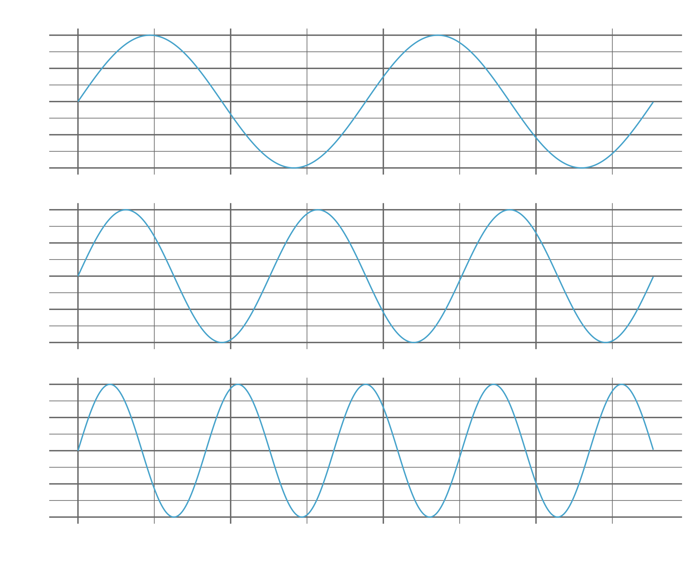
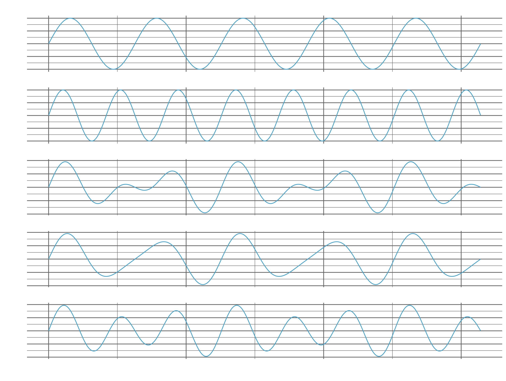
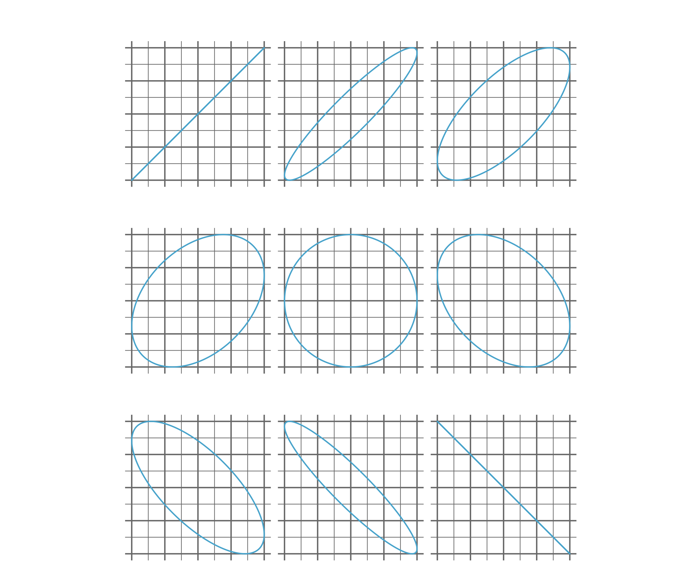
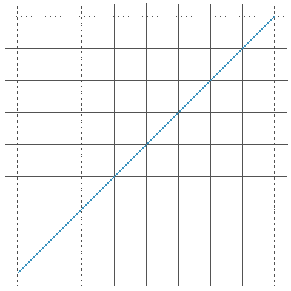
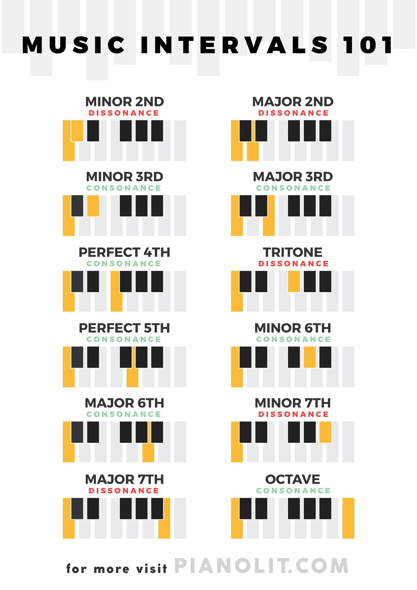
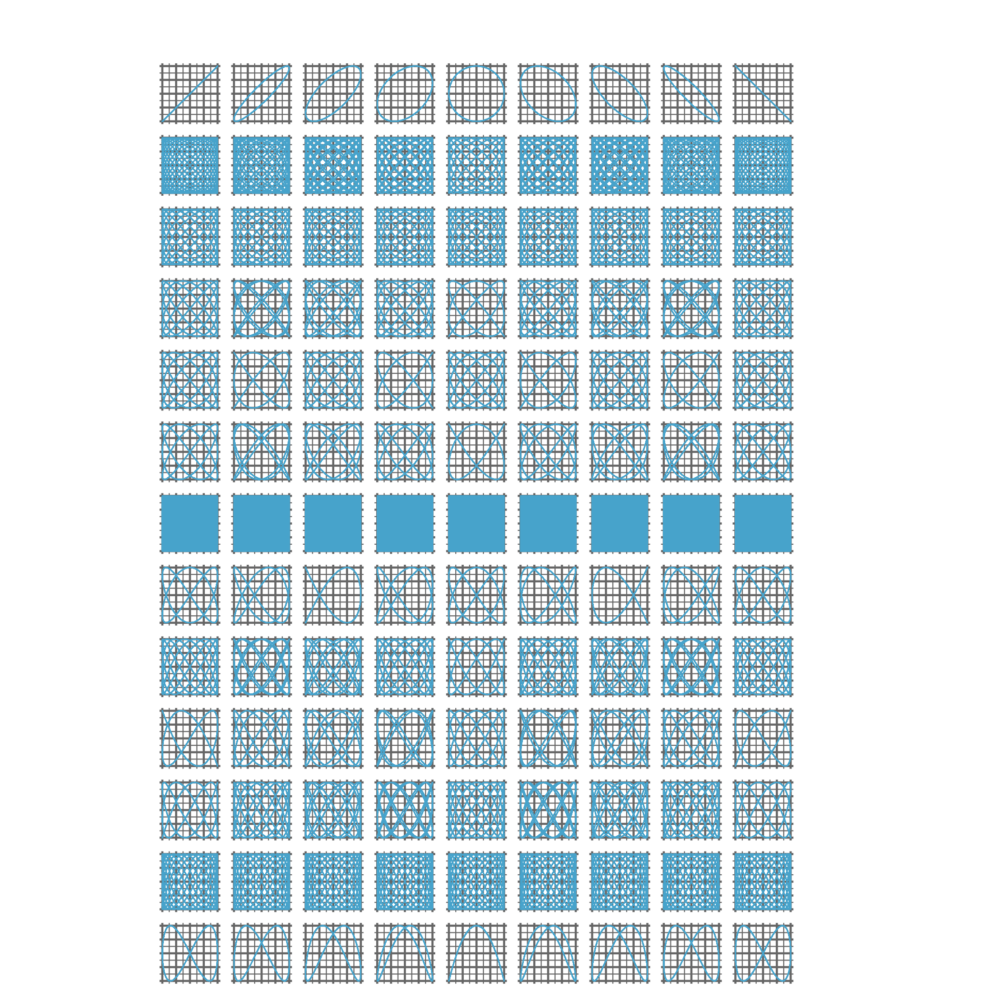
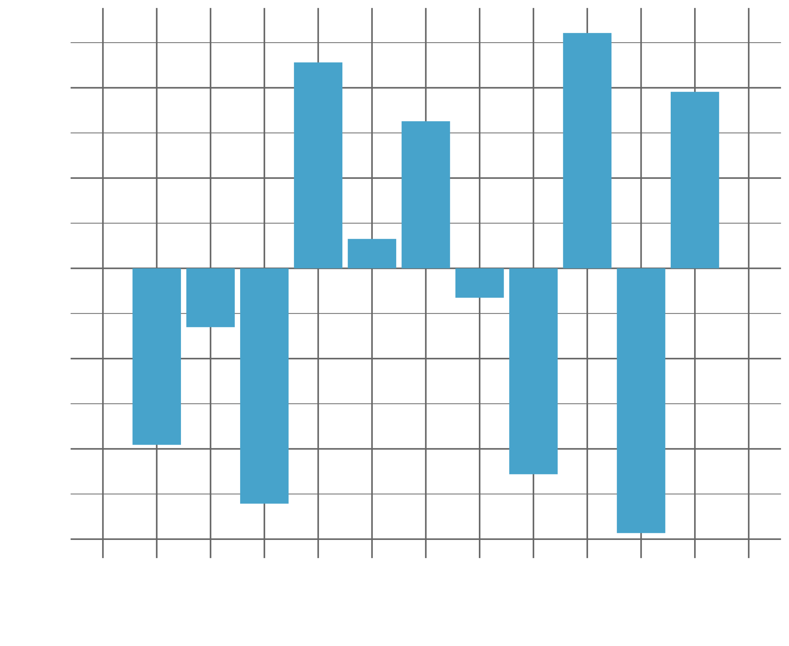

I have been playing trumpet now for almost 18 years, and I actually started on piano a little before that, so music has been a big part of my life. Growing up I played in various bands and ensembles and to keep up with the high standards I used to be able to play at you had to know a lot not just about your instrument but also about music theory. I took music theory classes and exams as a way to improve my understanding and to help me become a better musician, but it was always very formulaic and not that inspiring (there is another post that could be written here about the "westernisation" of music theory and the syllabus they choose to teach but that is for another time). However, a few years after this I started to find YouTube channels like [Adam Neely](https://www.youtube.com/@AdamNeely) and [Jacob Collier](https://www.youtube.com/@jacobcollier) and I started to get more of an appreciation for music theory itself.

The sort of clickbait title I have used for this article has been used many times before by people to talk about the same topic, but to keep themselves relevant to the general audience they tend to shy away from the underlying maths. Being a very amateur music theorist I am going to do the opposite and try and give the basics of the theory before giving a slightly deeper explanation of the maths.

## Pitch and Intervals

The only two parts of music theory you need to know to understand the paradox I will introduce later is the idea of pitch and intervals and how these relate to being "in tune". Pitch is related to how "high" or "low" a note is, but these concepts of "high" or "low" are ones that we have ascribed to the music, not ones that are intrinsic to it, other cultures use different descriptors. Scientifically speaking, a note is a wave and pitch relates to the frequency with which that wave oscilaltes. The greater the frequency the "higher" the pitch. Frequency is measured in Hertz (Hz), which is the number of oscillations per second. This means that each note can be mapped to a number, that is each note is a wave with a given frequency. For example, most orchestras and musical ensembles will tune to an A (or more specifically an A4, which also indicates what octave the A is in) that has a frequency of 440Hz. This means that the wave associated with the note A (or A4) oscillates 440 times per second and this will be the same for everyone, so people can tune separately but still be in tune with each other.



Now we know that we can take any musical note and use its pitch to map it to a number. An interval refers to the relative pitch between two notes. You calculate an interval by dividing the frequency of one note by the frequency of another (typically the larger frequency is dividied by the smaller one). As we are dividing a number measured in Hz by another number measured in Hz an interval has no units. We will dive more deeply into what the ratio for each interval is later.

## Visualising Intervals

Typically when looking at sound you would look at the interaction between two waves in terms of their constructive and destructive interference. That is to say you would "add" these waves together and see the resulting wave. I show this below by showing the frequency of one note, which I call the Tonic, and then the frequency of another note, which I call the Dominant. I then take varying linear convex combinations of these two waves and you can see how this affects the final output wave. 



However, there is another way to visualise the interaction beteen these two notes and that is to use something called a harmonograph. This contraption can be seen in the image below and it works  by having each of the two rods attached to the pen to also be attached to pendulums. These pendulums can then be set to oscillate at different frequencies and the pen will draw the interaction between these two waves. The harmonograph below actually has a third pendulum that is attached to the paper itself that also induces extra variation in the resulting wave interaction to produce interesting patterns, but this is not necessary for our purposes. As intervals (or pitch interactions) are dimensionless, we don't have to set the frequency of the two pendulums to be the same as the frequency of the notes playing, we just have to make sure the the relative frequency of the pendulumns is the same as the relative frequency of the notes.


Unfortunately, I do not own a harmonograph nor do I have access to one. I do however, have the ability to code and mathematically recreate one. Luckily, the maths of the harmonograph is fairly simple so I am going to simulate one in R. The harmonograph is essentially just a parametric equation with repsect to time, so we can start off by sampling regular intervals of our parametric variable, which I will call `t`. We can then find our x and y coordinates of two notes of the same pitch by using the following equations:


\\(x = \sin(t)\\)


\\(y = \sin(t)\\)

There is a little bit more to this though, this assumes that the notes are "in phase", meaning that they start oscillating at the same point in time. This isn't necessarily true so we also need to account for this in our parametric equations. To do this we can introduce a phase shift, which I will call φ or `phi`, and we can then use this to shift the start of the oscillation of one of the notes. This means that our equations become:


\\(x = \sin(t)\\)


\\(y = \sin(t + φ)\\)

Where φ is some yet to be determined contant. We can replicate this equation for multiple values of φ in R like this:

``` r
library(tidyverse)

expand_grid(
  phase = seq(0, pi, pi/8),
  t = seq(0, 2*pi, 0.01)
) %>%
  mutate(
    x = sin(t),
    y = sin(t + phase)
  )
```

`expand_grid` will find every combination of `phase` and `t` (our time parameter) and then using `mutate` we can calculate the x and y coordinates for each combination. We can then plot these coordinates using `ggplot2` and `geom_path` to get the plot below (for the sake of simplicity I have only included the actual code to make the plot, not to theme it).

``` r
expand_grid(
  phase = seq(0, pi, pi/8),
  t = seq(0, 2*pi, 0.01)
) %>%
  mutate(
    x = sin(t),
    y = sin(t + phase),
    phase = case_match(
      phase,
      0 ~ "Phase:\n0",
      pi/8 ~ "Phase:\nπ/8",
      2*pi/8 ~ "Phase:\nπ/4",
      3*pi/8 ~ "Phase:\n3π/8",
      4*pi/8 ~ "Phase:\nπ/2",
      5*pi/8 ~ "Phase:\n5π/8",
      6*pi/8 ~ "Phase:\n3π/4",
      7*pi/8 ~ "Phase:\n7π/8",
      8*pi/8 ~ "Phase:\nπ"
    ) %>%
      factor() %>%
      fct_reorder(phase)
  ) %>%
  ggplot() +
  aes(
    x = x,
    y = y
  ) +
  geom_path() +
  facet_wrap(
    ~ phase
  )
```



Here you can see multiple representations of the interaction between these two pitches at different phase shifts. There are infinitely many different phase shifts so I hace taken this data, extended the phase shift range to 2π and then animated it to show the interaction between these two pitches at every different phase shift. You can see this animation below.



Everything I have plotted above is for two notes of the same pitch, we say these notes are in unison and mathematically we would call this interval the trivial interval or trivial interaction. Now we can start looking at interactions between notes of different pitches, but first we are going to need to know a little bit more music theory.

## What Are the Ratios of Intervals?

Back before civilisation, before we had found the rules of music (or maybe more accurately, before we made up the rules of music) we had an idea of pitch but we didn't know what a "note" was, as all a note really is is a name we give to a certain frequency. We did however, know that some pitches sounded "good" together and some pitches sounded "bad" together. This idea of "good" and "bad" intervals is called consonance and dissonance. This is how the modern western scale came to be, some people found notes that sounded consonant (or good together) and this formed the basis of the notes we use today (this is I think the biggest oversimplification I have ever made in my life, the journey as to how we got to our current system is a long and complicated one, and I am not going to go into it here).

Generally what people found was that intervals that were made of "simpler" ratios tended to sound more consonant. A "simple" ratio is a relationship between notes that is charaterised by a fraction containing integers that are very small. For example, the most consonant interval is the unison interval, which has a frequency ratio of 1:1. Another very consonant interval is the octave, these are so consonant we give notes that are an octave apart the same name, all an octave is is a frequency ratio of 2:1. This means that if we take an A at 440Hz, then the note associated with the frequency 880Hz is also an A as 880:440 = 2:1.

Fifths are intervals that have a frequency ratio of 3:2. Again, 3:2 is a ratio comprising of integers that are very small, so this interval is very consonant. This is why a lot of western music is built around the circle of fifths, which is a diagram that shows the relationship between notes that are a fifth apart. There are lots of other intervals, so I have put a picture below that shows all of the intervals you can make using notes on a piano and whether those notes are generally considered consonant or dissonant.



Here are the ratios for each of those intervals:

| Interval       | Ratio | Consonant |
|----------------|-------|-----------|
| Unison         | 1:1   | Consonant |
| Minor Second   | 16:15 | Dissonant |
| Major Second   | 9:8   | Dissonant |
| Minor Third    | 6:5   | Consonant |
| Major Third    | 5:4   | Consonant |
| Perfect Fourth | 4:3   | Consonant |
| Tritone        | 45:32 | Dissonant |
| Perfect Fifth  | 3:2   | Consonant |
| Minor Sixth    | 8:5   | Consonant |
| Major Sixth    | 5:3   | Consonant |
| Minor Seventh  | 9:5   | Dissonant |
| Major Seventh  | 15:8  | Dissonant |
| Octave         | 2:1   | Consonant |

Then here are the harmonographs for each of these intervals, you can see that the "simpler", more consonant intervals produce simpler patterns with a shorter parametric period. With the most dissonant of intervals, the tritone, producing such a complex pattern that it appears to completely fill the space.



And animated it looks like this:


## So What's the Problem?

So now we know that a note is just a given pitch in Hertz and we can move from one note to another by finding the interval between the two notes, finding the ratio associated with that interval and multiplying our current frequency by that ratio. So let try an example of this, imaging we are at A4 at 440Hz and we want to move to A5 at 880Hz. Well we just multiply our current frequency by 2


\\(440 \times 2 = 880\\)

Now lets say we want to move from A4 to A5 again, but this time we want to vo via the perfect fifth, i.e. we want to go from A4 to E4 to A5. This means we want to go up a perfect fifth and then up a perfect fourth which is the same as multiplying by 3/2 and then by 4/3.


\\(440 \times \frac{3}{2} \times \frac{4}{3} = 440 \times \frac{4 \times 3}{3 \times 2} = 440 \times \frac{4}{2} = 440 \times 2 = 880\\)

Now let's say we would like to go up a major scale. In western music a major scale is made up of the following intervals:
Major Second, Major Second, Minor Second, Major Second, Major Second, Major Second, Minor Second. Well this is easy, we just multiply by the ratios of each of these intervals in turn.


\\(440 \times \frac{9}{8} \times \frac{9}{8} \times \frac{16}{15} \times \frac{9}{8} \times \frac{9}{8} \times \frac{9}{8} \times \frac{16}{15} = 440 \times \left(\frac{9}{8}\right)^5 \times \left(\frac{16}{15}\right)^2\\)


\\(\approx 440 \times 2.0503125 = 902.1375\\)

Here we have run into the problem: 


\\(880 \neq 902.1375\\)

So what's gone wrong? We have used the right intervals but taking two different paths and have ended up on different notes when we should have ended up on the same one. This is the paradox at the center of tuning in music. In order to stay in tune with respect to the pitch at which you start off playing, you either have to stick to a very restricted set of intervals and therefore notes or at somepoint you wll have to use an incorrect interval. Or you can use the correct intervals at every stage, but just accept you will end up on a different note to the one you started on.

This is demonstrated brilliantly, as well as explained much better, in a video by [Adam Neely](https://www.youtube.com/@AdamNeely)



## How Do We Solve This Problem?

In short: you can't *solve* the problem fully, but we have generally settled on a solution that is good enough. We use a system called twelve tone equal temperament (12-TET). This system divides the octave into 12 equal parts, so that each semitone is the same size. This means that the ratio between each semitone is the same (on a log scale). To move from one note up a semitone (or a minor second) the ratio is 


\\(2^\frac{1}{12}\\)

Then every other interval is made by moving up the requisite number of semitones. A major second is two semitones, so the ratio is



\\(2^\frac{1}{12} \times 2^\frac{1}{12} = \left(2^\frac{1}{12}\right)^2 = 2^\frac{2}{12}\\)

A perfect fifth is seven semitones, so the ratio is



\\(2^\frac{1}{12} \times 2^\frac{1}{12} \times 2^\frac{1}{12} \times 2^\frac{1}{12} \times 2^\frac{1}{12} \times 2^\frac{1}{12} \times 2^\frac{1}{12} = \left(2^\frac{1}{12}\right)^7 = 2^\frac{7}{12}\\)

An octave is twelve semitones, so the ratio is

\\(2^\frac{1}{12} \times 2^\frac{1}{12} \times 2^\frac{1}{12} \times 2^\frac{1}{12} \times 2^\frac{1}{12} \times 2^\frac{1}{12} \times 2^\frac{1}{12} \times 2^\frac{1}{12} \times 2^\frac{1}{12} \times 2^\frac{1}{12} \times 2^\frac{1}{12} \times 2^\frac{1}{12}\\)


\\(= \left(2^\frac{1}{12}\right)^{12} = 2^\frac{12}{12} = 2\\)

So therefore any interval that is a jump of n semitones has a ratio of


\\(\left(2^\frac{1}{12}\right)^{n} = 2^\frac{n}{12}\\)

We can then look at the difference between the ideal ratio of the interval (called just intonation) and the ratio of the interval in twelve tone equal temperament (12-TET). Below I have divided the 12-TET ratio by the just intonation ratio and plotted the difference on a log scale.



This means that in general western music has settled on a system that uses slightly out of tune intervals, but they are close enough that most people do not notice and allows for many types of instruments to be made that can play in tune with each other by having fixed frequencies for each note. However, when you play an instrument like a piano or a xylophone, then there is only one way to generate a certain pitch, that is pressing/hitting the right key. But when I am playing the trumpet I can change the pitch of a note by pressing different valves but also by changing the tension in my lips (by changing my embouchure). Large changes in embouchure will completely change the pitch (this links in with the length of my trumpet and the overtone series, that I would like to talk about at another time) but small change in embouchure will change the pitch a small amount. This means that sometimes I will play a note that might be slightly out of tune according to twelve tone equal temperament but close to just intonation meaning it is still possible to get justly intonated chords in the 12-TET framework. People will often refer to this as a chord "settling down" and becoming "locked in".

## Exensions of Equal Temperament

We have taken the octave and divided it into 12 log-linearly equidistant notes. But there is no restriction on keeping to 12 tone equal temperament, we could divide the octave into any number of notes. In general we call this n tone equal temperament where for the smallest interval we use the ratio


\\(2^\frac{1}{n}\\)

and as there are n of these intervals in an octave, the ratio of the octave is




\\(2^\frac{1}{n} \times 2^\frac{1}{n} \times \cdots \times 2^\frac{1}{n} \times 2^\frac{1}{n} = \left(2^\frac{1}{n}\right)^n = 2^\frac{n}{n} = 2\\)

Music that uses tones that fall outside of the 12-TET framework is called microtonal music and I have included some of my favourites below.

## Microtonal Music Examples

This is not an exhaustive list, just some songs I like (and which arent' too out there to not put people off - it takes some getting used to).

We can start off with microtonal electronic music from Sevish, do check out his album Harmony Hacker. This song is in 22-TET and also in 5/4 time which makes it a bit more of a mind bender.



Some 17-TET funk that just slaps



Most importantly, some Jacob Collier magic. I very much recommend also watching the his [breakdown session](https://www.youtube.com/watch?v=9d4-URyWEJQ&t=3229s) where he talks through the whole song in depth. **IF YOU DO NOTHING ELSE, WATCH FROM 5:40 IN THIS VIDEO** to hear Jacob Collier modulate into D "half sharp" major without you even noticing using microtonal adjustments to the pitch of the notes oroducing something very much not as "crunchy" as the other examples here.



Finally, I very much recommend looking into the story of the Australian band King Gizzard and the Lizard Wizard as well as there album Flying Mcrotonal Banana. A personal favourite of mine is Rattlesnake

