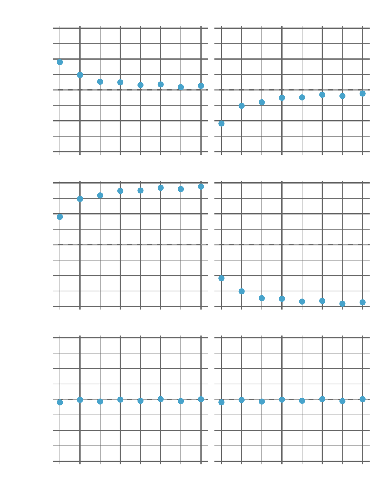

It's something that I didn't notice for years, but R doesn't round numbers normally. When we were at school we were taught that to round a number to the nearest integer you look at the first decimal place and if it's more that 5 you round up, less than five you round down and in the annoying case where you have a number halfway between two integers you just round it up. Now, if you open up your R console and type in `round(1.5)` you'll get `2` as the answer, but if you type in `round(2.5)` you will also get `2` as the answer. What's going on?

It's important to remember that R is primarily a language developed for statistical analysis and that is where the core of this issue resides. I wrote a small script to simulate an example to demonstrate the problem. In this example I sample from a set of numbers that are between 0 and 100, but each time I do this the numbers are sampled at a different resolution, what do I mean by this? Well, when I first sample the numbers I sample them at a resolution of 2, this means that every integer is split into 2 (i.e. the measurement can have a value of 2 or 2.5). If I were to sample with a resolution of 4 then every integer would be split into 4 (i.e. the measurement can have a value of 2, 2.25, 2.5 or 2.75).

Let's say I uniformly sample from 0 to 100 with a resolution of 2 (i.e. numbers can only be an integer or halfway between integers), then roughly speaking half of the numbers will be some integer and a half. What happens when we round this? If we were to do it the way we were taught at school then each of these numbers would be rounded up to the next integer. So let's say we were running an experiment measuring shoe sizes. Here in the UK shoe sizes come as integers or you can have "half sizes" which are halfway between two sizes. Let's say in our analysis we decided to round all of the half sizes so we only had "whole sizes". If we were to do this, all of these half sizes would be rounded *up* which would increase the mean and other estimated population statistics of our sample. As our resolution increases (i.e. when it is less likely that a given observation will be *exactly* halfway between two integers) the effect of this rounding bias decreases. But it is still there and is a surprisingly common problem for statisticians to encounter.

What other rounding options are there? For this short blog post I am going to talk about 6 different rounding methods. The first we have already covered and is what I am going to call "normal" rounding, where all numbers are rounded to the closest integers and half numbers are always rounded up. The second method, I will call "reverse" rounding, which is exactly the same except any half nnumbers will be rounded down. As you can imagine this has exactly the same problems as normal rounding just with getting slightly different answers.

The next two methods I am going to talk about are the "ceiling" and "floor" rounding methods. These are even more extreme than normal rounding, for the floor function numbers are always rounded down. Therefore, 2.2 and 2.9999999 will both be rounded down to 2. The ceiling function is the opposite, all numbers are rounded up. As you can imagine, these are even worse than "normal" rounding when it comes to affecting the mean and other population statistics but I mention them as they are used incredibly often and it is something I always have in the back of my time whenever I implement them myself.

The fifth method I am going to call radom rounding. In this method I have rounded numbers just like normal, except when it comes to half numbers I flip a coin and depending on the outcome I randomly round the number up or down. This is actually my favourite way of dealing with this specific problem but it does have a very big floor: it's non-deterministic. A deterministic function is a function that will always give you the same output when you give it the same input. For example, when we round 3.8 we will always get 4 and when we round 2.5 using "normal" rounding we will always get 3. But random rounding is not like this, if we round 2.5 using random rounding we might get 2 or we might get 3. This is a problem for reproducilibity and despite its benefits is why it isn't used that much.

The last method is what R uses and it is called bankers rounding. In bankers rounding, numbers again are rounded to their nearest integers, but when it comes to half numbers these are rounded to the nearest even number. This is what you are using when you use the `round` function in R and if you are sampling uniformly and on a large enough range then just as many numbers will be rounded up as are rounded down and so the mean and other population statistics are not affected.

Here are the results of my simlations sampling between 0 and 100 at different resolutions, rounding using different methods and then calculating the mean. The true mean of these samples should be 50 but you can see that at different resolutions the different rounding methods have different amounts of bias.

You can see that random rounding and bankers rounding are the only ones that are consistently around the mean at every resolution. However, a warning does come with bankers rounding. I mentioned above that bankers rounding only doesn't affect the mean if you are sampling uniformly and on a large enough range. For example, if you are sampling non-uniformly you may sample 7.5 more times than you sample 8.5, causing more numbers to be rounded up to 8 than down that will increase the mean that you calculate. Or let's say that you are only sampling the numbers 7, 7.5 and 8 then bankers rounding will always round 7.5 up and again your mean will be over estimated. This is why it is important to understand that bankers rounding is not perfect and there are rare but not impossible situations where it will cause big problems.